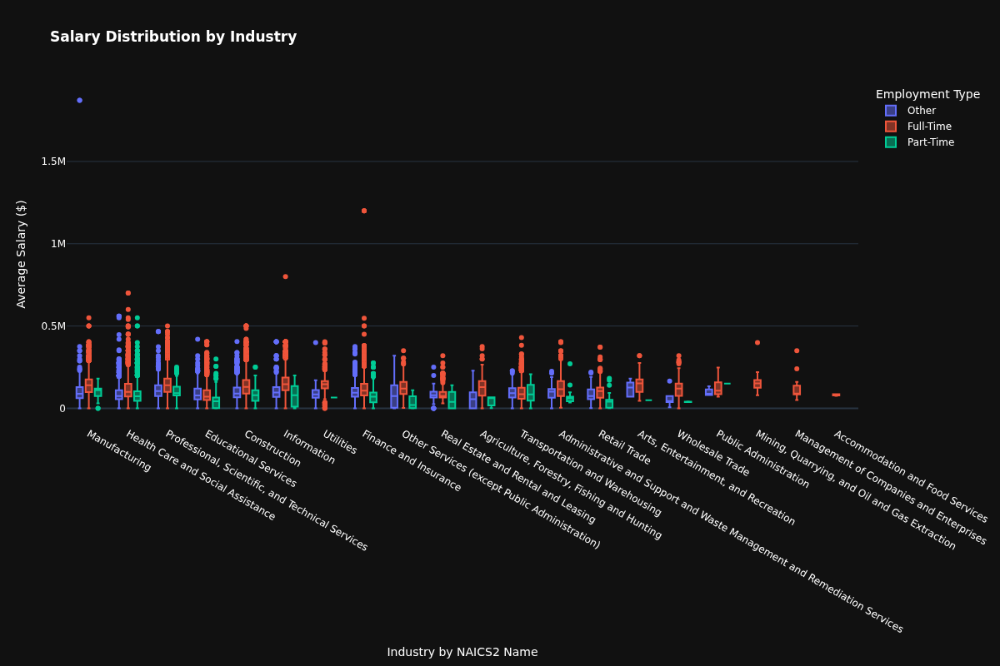
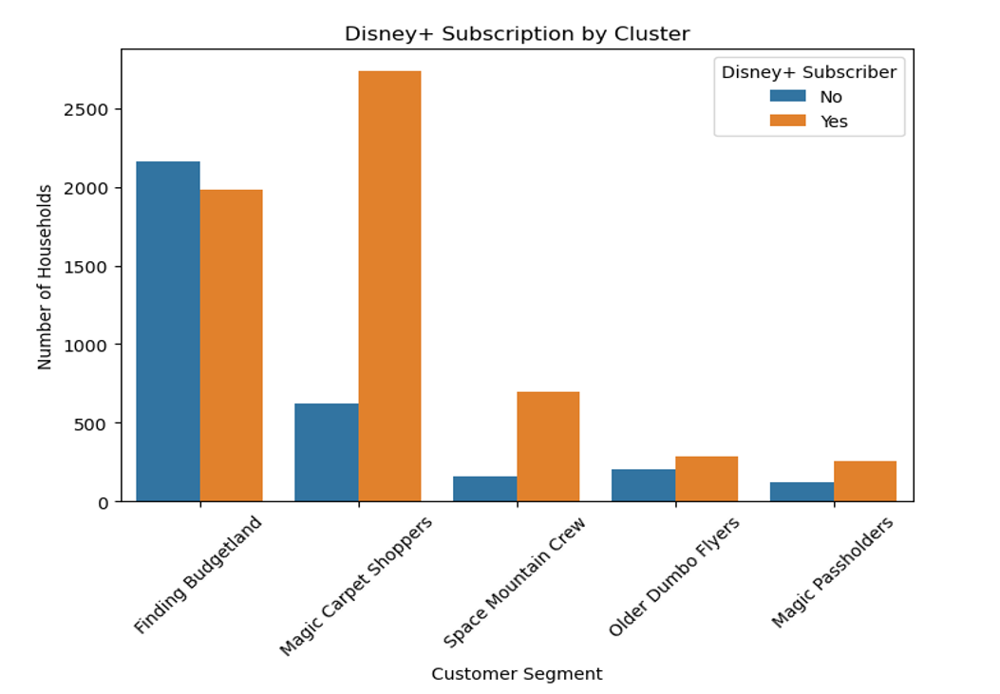
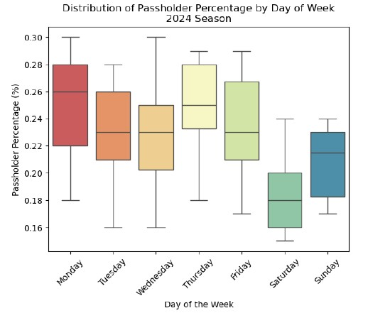
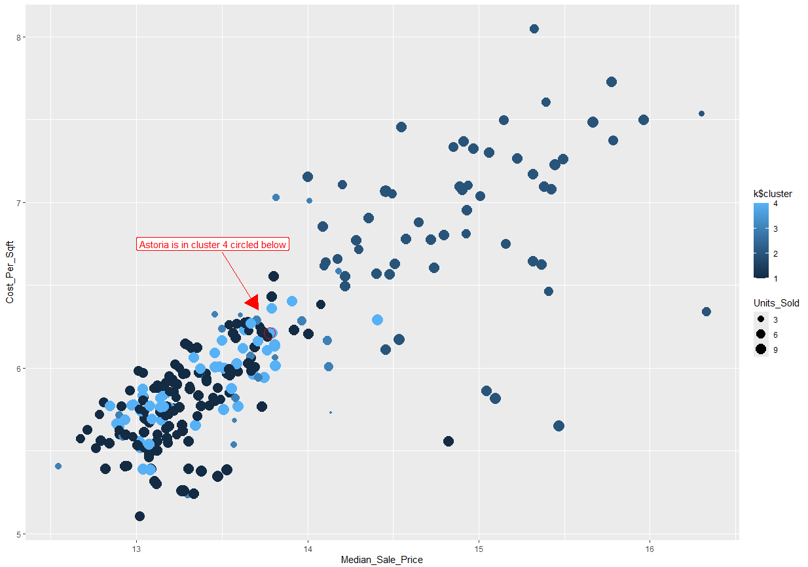

## Big Data Job Market - Salary Analysis

Processed and analyzed 500,000+ job postings to examine salary patterns across industries, occupations, education levels, experience, and employment types.

**Tools & Technologies:** Python, PySpark, SQL, Plotly

**Course:** MED AD 688

## Disney Parks - Customer Segmentation

Applied K-means clustering to 9,000+ households to identify customer segments based on spending, visitation, demographics, and Disney+ behavior.

**Tools & Technologies:** Python, Pandas, NumPy, Scikit-learn, Matplotlib, Seaborn, K-means Clustering

**Course:** MET AD 654

## Lobster Land - Operational & Revenue Analysis

Analyzed fictional amusement park operational data to identify revenue trends, labor efficiency, visitor behavior, weather patterns, and seasonal performance.

**Tools & Technologies:** Python, Pandas, Matplotlib, Seaborn, Tableau

**Course:** MET AD 654

## NYC Real Estate - Neighborhood Analysis

Analyzed NYC real estate transactions to compare neighborhoods, with a focus on Astoria, sales activity and property prices using statistical testing and clustering to identify differences within the market.

**Tools & Technologies:** R, SQL, dplyr, ggplot2, K-means Clustering, Statistical Analysis

**Course:** MET AD 571

